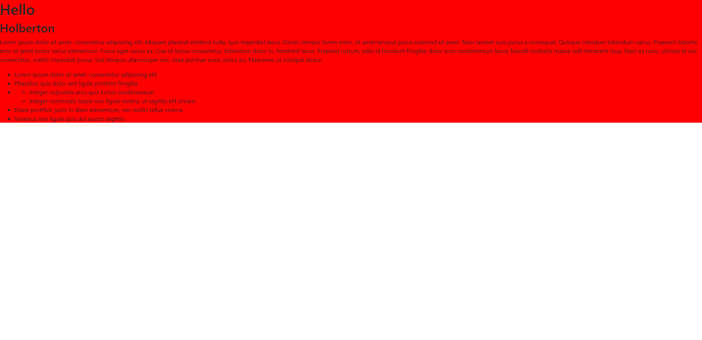
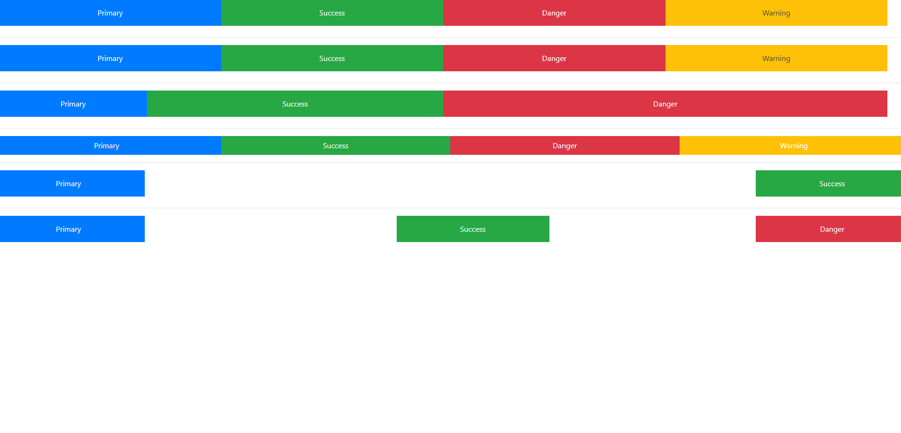
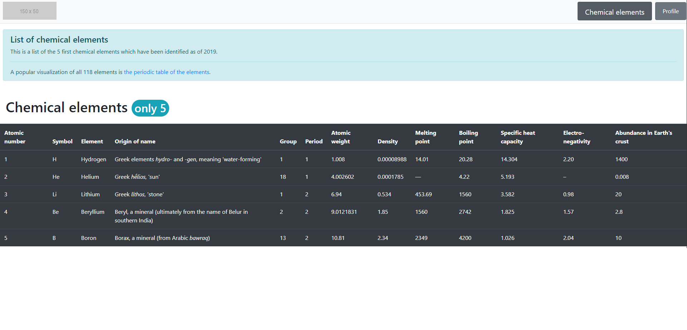
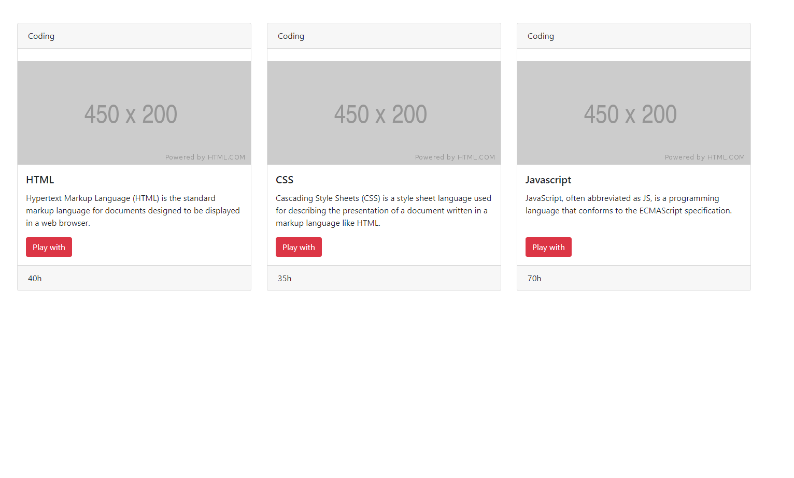
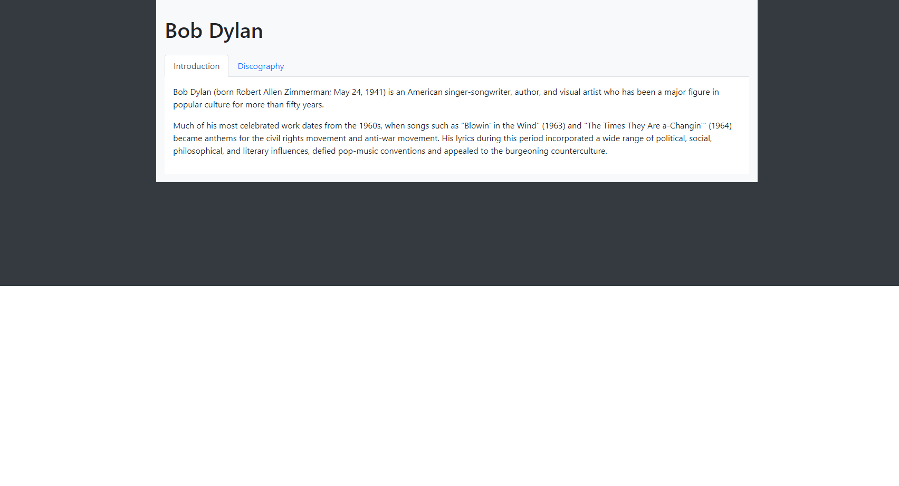
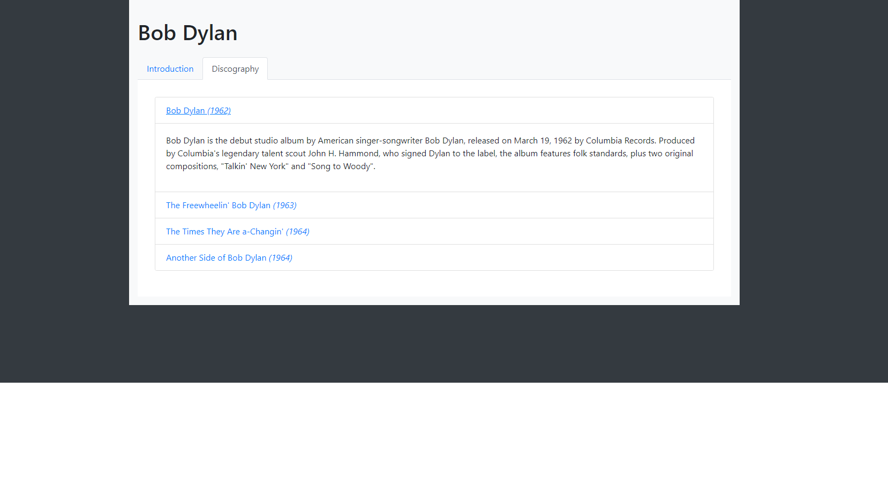
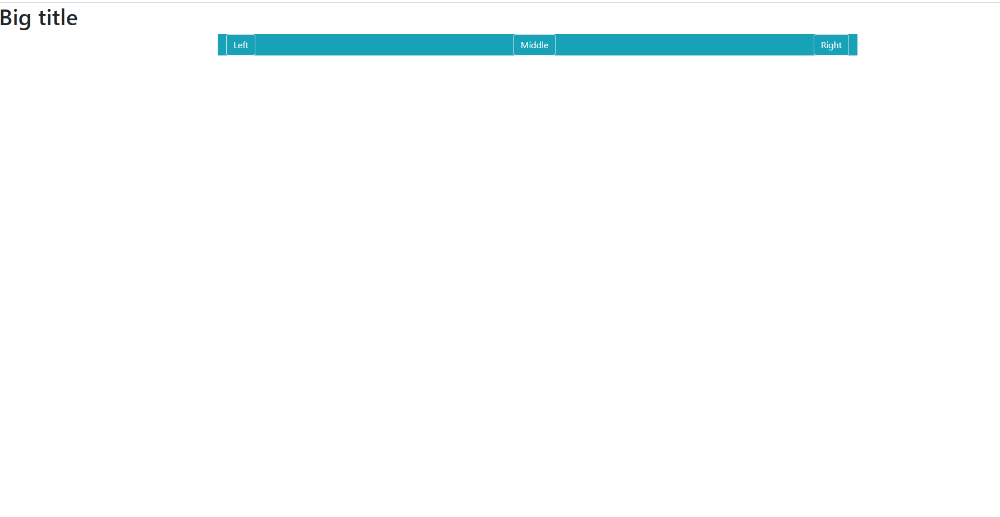
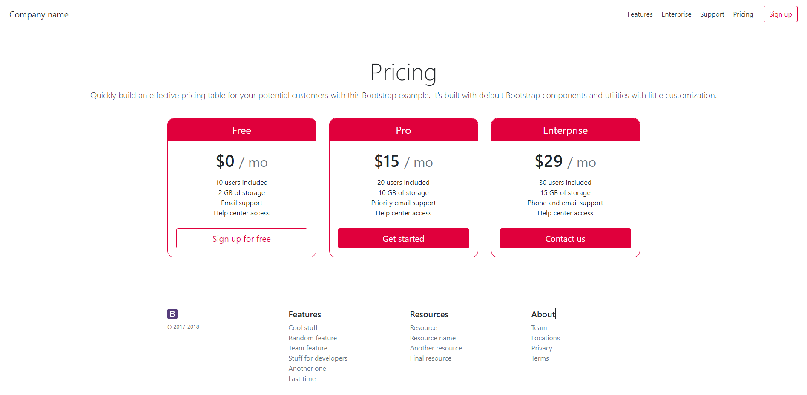

<h1>0x0A. Bootstrap</h1>

Bootstrap is a free and open-source CSS framework directed at responsive, mobile-first front-end web development. It contains CSS and JavaScript design templates for typography, forms, buttons, navigation, and other interface components.

For this project, you will use Bootstrap 4.4 and only the CSS styling part.

<h2>Task</h2>

  <h3>0. Reboot styling</h3>
  

  <h3>1. Blocks</h3>
  

  <h3>2. Table of chemical elements</h3>
  

  <h3>3. Cards</h3>
  

  <h3>4. Bob Dylan</h3>
  
  

  <h3>5. Show/Hide - screen size</h3>
  

  <h3>6. Overwrite CSS</h3>
  

